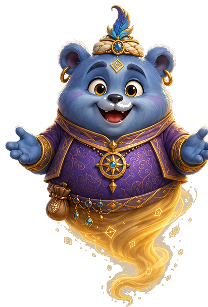

# JACK, JIA & ZAFIR'S QUEST
### A Prepositions of Position Adventure
ESL A2–B1 · 100 Gaps

**The nine prepositions used in the game:**
NEXT TO · IN FRONT OF · BEHIND · ABOVE · BELOW · UNDER · INSIDE · ON TOP OF · BETWEEN

---

## CHAPTER 1 — THE BOTTLE 🏖️

*A quiet beach. Late afternoon.*

Jack and Jia were walking along the beach when Jia suddenly stopped.

"Jack."

"What?"

"Look."

She was pointing at a dark green bottle, half buried in the sand.

Jack walked over and picked it up. Something inside it was moving, and a faint light flickered.

"There's a light ___________ the glass," said Jack.

**[1]**
A. behind
B. above
C. between

"Open it!"

"Are you sure?"

"No."

Jack laughed and pulled out the cork anyway.

Nothing happened.

They waited.

Still nothing.

Then—

WHOOSH!

Blue smoke exploded out of the bottle and Jia jumped back.

The smoke rushed upward and began to spin. Out of it came a small, round creature with greyish-purple fur, black rounded ears, gold hoops in his ears, a little cap with a single blue feather tilted over one eye, and a richly patterned purple-and-gold robe.

Where his legs should have been, there was only a swirl of golden smoke.

He floated ___________ them, arms wide, beaming down with the widest smile Jack had ever seen.

**[2]**
A. above
B. behind
C. below

"Finally!" he shouted.

Jack stared.

Jia stared.

"Well?"

"Well what?" asked Jack.

"Say something!"

"You're a genie," said Jia.

"Correct! My name is Zafir."

He drifted down until he was floating ___________ the rock beside them, close enough that his robe brushed the stone.

**[3]**
A. next to
B. above
C. behind

"And you were in that bottle?" asked Jack.

"For about a thousand years."

"That's a long holiday," said Jack.

Zafir's smile faded.

"Someone put me there. To get out, I need to break a spell. There are twelve magic boxes, scattered across twelve countries. Bring them together, and the spell breaks."

"That sounds like an adventure," said Jia.

Zafir clicked his fingers, and a beautiful carpet appeared on the sand.

It landed ___________ the rock, with the rock directly beside it.

**[4]**
A. next to
B. behind
C. above

"You're joking," said Jack.

"Does it really fly?"

"There's only one way to find out."

They climbed on, and the carpet rose into the air.

The beach dropped farther and farther ___________ them.

**[5]**
A. below
B. above
C. behind

Zafir flew ahead of them. He was clearly ___________ the carpet, leading the way through the clouds.

**[6]**
A. in front of
B. behind
C. under

Jia sat down ___________ Jack, gripping his arm.

**[7]**
A. next to
B. between
C. behind

"Where are we going?" Jack called.

"China!"

"Why China?"

"Because that's where our first adventure begins!"

Jia looked at Jack.

"Here we go."

---

## CHAPTER 2 — THE TEAHOUSE 🇨🇳

*Beijing.*

The carpet dropped quietly into a street, and Zafir led them through a doorway into a warm little teahouse.

"Let's get something to eat," said Jack.

"We just ate."

"I'm hungry again."

They found a table ___________ the window, with only a short space between the table and the window.

**[8]**
A. next to
B. behind
C. above

Zafir suddenly went still.

"Wait. Did you see that?"

"See what?"

He pointed.

A small yellow box was sitting ___________ the teapot, touching its handle.

**[9]**
A. next to
B. above
C. behind

Jia leaned in for a closer look.

A small key was lying ___________ the two teacups, wedged in the narrow gap.

**[10]**
A. between
B. behind
C. above

"Look!"

Jack picked it up, fitted it into the lock, and turned it.

Click.

The lid opened.

Inside was a small golden stone.

"Don't touch it," said Zafir.

"Why?"

"It might be magical."

"That's not a reason."

"It is when I say it."

Jack reached for it anyway.

The stone leapt out of the box and shot across the room.

It flew past them and stopped ___________ Jia, hovering directly between her and Jack.

**[11]**
A. in front of
B. behind
C. above

"Is it supposed to do that?"

"No," said Zafir.

The stone shot sideways and vanished ___________ a folding screen. The screen completely hid it from view.

**[12]**
A. behind
B. above
C. next to

Jia hurried over.

"Where did it go?"

She crouched.

It had rolled ___________ a low table, with the tabletop directly above it.

**[13]**
A. under
B. above
C. behind

She grabbed it, and it stopped glowing.

"Is that one of the boxes?" asked Jia.

"No. A key. To what, that's the fun part."

Zafir tucked the yellow box into the pouch on his belt.

Outside, red lanterns lit the street.

They glowed ___________ the food stalls, with the stalls directly below them.

**[14]**
A. above
B. below
C. between

"Come on," said Jia. "I want to know what that key opens."

"So do I," said Zafir.

---

## CHAPTER 3 — A NIGHT IN SEVILLE 🇪🇸

The carpet swept through the evening sky.

Seville appeared below them, glowing with warm lights.

Music began to spill out of a small restaurant.

"That sounds good," said Jia.

"It smells good too," said Jack.

A waiter showed them to a table, and a guitarist began to play.

Zafir settled ___________ Jack and Jia, with Jack on one side and Jia on the other.

**[15]**
A. between
B. behind
C. above

"This is beautiful," he whispered.

When the song ended, everyone clapped.

Then Zafir pointed towards the kitchen.

"That's strange."

"What?"

"That blue box, ___________ the kitchen door."

**[16]**
A. next to
B. above
C. behind

Jack opened it.

Empty—except for a tiny piece of blue glass sitting inside.

He picked it up.

The restaurant lights suddenly went out.

"Did you do that?" Jia whispered.

"No," said Zafir.

The lights came back.

The glass was gone.

Jia looked down and found it ___________ Jack's shoe, hidden from her view by the shoe itself.

**[17]**
A. behind
B. above
C. next to

Jack picked it up.

It began to glow, tracing a thin blue line across the floor and out into the street.

They followed it until it stopped ___________ an old stone fountain, with the fountain only a few steps away.

**[18]**
A. next to
B. behind
C. above

Jia crouched and reached under the rim.

"There's something here," she said.

She pulled out a small blue box sitting ___________ the fountain's stone lip, on the side facing her.

**[19]**
A. in front of
B. behind
C. above

"Two," said Jia.

Zafir looked at the sky.

"Indonesia is next."

---

## CHAPTER 4 — THE WOODCARVER 🇮🇩

The carpet flew above a wide stretch of blue ocean before Bali came into view.

In a small village, a man was carving outside his house when Zafir flew down, grinning.

Mateo's knife stopped mid-cut. He stared for a long moment.

"The genie of the bottle," he said quietly. "My grandmother told me stories about you."

Jack looked at Jia.

"He's heard of him. Not met him."

"Good," she whispered. "That one actually makes sense."

Mateo's workshop was full of wooden animals, bowls and toys.

A pile of boxes tipped over with a crash, and Jia hurried to help him stack them.

A small green box had rolled ___________ two carved elephants, wedged tightly between them.

**[20]**
A. between
B. behind
C. above

Mateo picked it up, opened it and frowned.

"Empty."

Zafir shook his head.

"Look again."

Jia turned it over.

A tiny picture had been tucked ___________ the lid, hidden by the hinge on the far side.

**[21]**
A. behind
B. above
C. next to

Mateo studied it.

"Ah—that's my old carving."

"Where is it?"

He pointed towards the back wall.

"It's ___________ the workbench. You can't see it from here."

**[22]**
A. behind
B. above
C. between

They found the carving and turned it over.

A second green box was hidden ___________ a loose wooden panel at the bottom of the carving.

**[23]**
A. under
B. above
C. next to

"So it was hidden inside the carving all along," said Jack.

"Exactly," said Mateo.

Jia slid it ___________ the first two boxes in the bag, with the boxes touching side by side.

**[24]**
A. next to
B. behind
C. above

"Thanks, Mateo."

"Come back one day!"

Outside, Mateo stood ___________ the workshop entrance and waved as the carpet lifted away.

**[25]**
A. in front of
B. behind
C. above

"Japan!" shouted Zafir.

---

## CHAPTER 5 — DON'T MAKE A SOUND 🇯🇵

The carpet drifted above misty green hills before landing softly near a quiet garden.

They paused ___________ a stone lantern, with only a short space between them and the lantern.

**[26]**
A. next to
B. behind
C. above

"Remember," whispered Jia. "We're supposed to be quiet."

Zafir nodded.

"I can be very quiet."

CRASH!

A cup lay on the floor.

Everyone looked at Zafir.

"Sorry," he whispered.

The woman only smiled.

She placed a red box on a small shelf ___________ the table, with the table directly below the shelf.

**[27]**
A. above
B. below
C. between

She held it up ___________ Jack, so that the box was directly between her and him.

**[28]**
A. in front of
B. behind
C. above

Jia leaned forward.

Zafir leaned forward too—too far.

His nose touched the table.

Tap.

"Sorry," he whispered again.

The woman laughed and pointed at the stone.

It lifted itself out of the box.

It rose ___________ the box, with a clear space between the stone and the open box.

**[29]**
A. above
B. below
C. behind

It drifted towards the children.

It hung ___________ Jack and Jia, with one child on each side.

**[30]**
A. between
B. behind
C. above

"I think it wants you," said Jia.

Jack reached out.

The stone darted away.

It shot across the room and vanished ___________ a hanging curtain.

**[31]**
A. behind
B. above
C. between

They followed it into the next room.

It was glowing softly ___________ a floor cushion, with the cushion directly above it.

**[32]**
A. under
B. above
C. behind

Jack scooped it up.

Zafir tucked the red box ___________ his belt, where the fabric completely enclosed it.

**[33]**
A. inside
B. behind
C. above

They bowed to their host and slipped outside.

"How many times are you going to say sorry today?" asked Jack.

"Probably a lot," said Zafir.

---

## CHAPTER 6 — RAIN IN PARIS 🇫🇷

The carpet flew high above the English Channel just as the first clouds rolled in.

**[34]**
A. above
B. below
C. behind

"Great," said Jack, as the rain started.

"You don't like rain?"

"I like rain when I'm inside."

They ran for a small café.

Clouds gathered ___________ the rooftops, with the rooftops far below.

**[35]**
A. above
B. below
C. between

A waiter stopped ___________ their table, facing them with the tray in his hands.

**[36]**
A. in front of
B. behind
C. above

He set down three cups of hot chocolate.

He placed them ___________ each other in a neat row, with each cup touching the next one.

**[37]**
A. next to
B. above
C. behind

Zafir sipped his.

"That's amazing. I've been trapped in a bottle for a thousand years. I missed a lot."

Then Jia noticed something on the table.

A small silver box sat ___________ the sugar bowl and the milk jug, with one object on each side.

**[38]**
A. between
B. behind
C. above

Before Jack could reach it, a gust of wind blew through the open door.

The box skidded off the table and landed ___________ a chair leg, with the chair seat directly above it.

**[39]**
A. under
B. above
C. behind

"Catch it!"

Jia scooped it up.

The box was now ___________ her hands, completely enclosed by her fingers.

**[40]**
A. inside
B. above
C. behind

"Got it."

"The rain's stopped," said Zafir, looking through the window.

"Where now?"

"Moscow."

"Does Moscow have hot chocolate?" asked Jack.

"Probably," said Zafir.

---

## CHAPTER 7 — A VERY COLD WALK 🇷🇺

The carpet had flown above pale winter fields for an hour before Moscow appeared, white with frost.

**[41]**
A. above
B. below
C. behind

"I can't feel my fingers," said Jack.

"You said that in Paris."

"Paris was different."

A street musician was playing near the cathedral, his case open on the ground.

A purple box sat ___________ the case, tucked behind the raised lid.

**[42]**
A. behind
B. next to
C. above

Jia pointed.

The musician smiled and nodded towards it.

Jack opened it.

A small silver key lay inside.

Suddenly Zafir shouted.

"Look out!"

A large dog came bounding towards them.

It skidded to a stop ___________ Jack, facing him directly.

**[43]**
A. in front of
B. behind
C. above

"Hello," said Jack carefully.

The dog licked his glove and trotted off.

Jack looked down.

His glove was missing.

It had fallen ___________ a wooden bench, with the bench seat directly above it.

**[44]**
A. under
B. above
C. behind

He picked it up as they walked towards the cathedral.

Its towers rose high ___________ the square, with the square far below them.

**[45]**
A. above
B. below
C. behind

The whole cathedral stood ___________ them by the time they reached the steps.

**[46]**
A. in front of
B. behind
C. above

"Wow," said Jia.

Zafir tucked the purple box ___________ the other boxes in his bag, with all the boxes safely enclosed inside.

**[47]**
A. inside
B. above
C. behind

"India next," said Zafir.

---

## CHAPTER 8 — BREAKFAST WITH A VIEW 🇮🇳

The carpet landed on a rooftop in Agra just as the sun came up.

The river Yamuna wound ___________ the rooftop, a distant silver thread they had to lean over the wall to see.

**[48]**
A. below
B. above
C. behind

The Taj Mahal shone in the morning light.

Jack stood ___________ Jia at the wall, both of them staring.

**[49]**
A. next to
B. behind
C. above

"Beautiful," he said.

A woman brought them breakfast and set down two plates with a basket of fruit.

The basket sat ___________ the two plates, exactly in the middle.

**[50]**
A. between
B. behind
C. above

Zafir reached for three bananas.

"Three?"

"I'm hungry."

"Put one back."

He sighed and put one back.

Then Jia noticed a golden box near a low stool.

It was sitting ___________ the stool, hidden from view by the stool itself.

**[51]**
A. behind
B. above
C. next to

She picked it up.

It was warm.

She opened it.

A tiny golden key floated out on its own.

It drifted towards the wall and stopped ___________ a painting, between Jia and the painting.

**[52]**
A. in front of
B. behind
C. above

"Look behind the painting," said Zafir.

Jack moved it aside.

A small hole had been carved ___________ the painting, hidden from the room by the painting itself.

**[53]**
A. behind
B. above
C. between

Inside was a note:

KEEP GOING.

"That's getting a bit repetitive," said Jack.

"It's good advice," said Zafir.

Jia tucked the golden box ___________ the growing pile in the bag, with the bag completely enclosing it.

**[54]**
A. inside
B. behind
C. above

"Brazil," said Zafir, as the carpet rose.

---

## CHAPTER 9 — MUSIC IN RIO 🇧🇷

The carpet swooped above the rainforest canopy, and the music grew louder as they dropped into Rio.

**[55]**
A. above
B. below
C. behind

It led them straight into a studio where a group of musicians were practising.

"Visitors! Come and join us!"

Soon everyone was clapping.

Zafir was dancing badly and proudly at the same time.

"You can't dance!" laughed Jack.

"I can dance while falling. It's harder."

A drummer pointed to an orange box.

It was sitting ___________ the tall speaker, with the speaker completely blocking it from view.

**[56]**
A. behind
B. above
C. next to

Jack opened it and set it on a stool.

The music started up again.

The box sat ___________ Jack's feet, with the stool and box beside his shoes.

**[57]**
A. next to
B. above
C. behind

Jia had already slipped away.

She stood ___________ the drummer so she could watch every beat.

**[58]**
A. next to
B. behind
C. above

Then she waited ___________ the studio door when Jack finally caught up.

**[59]**
A. in front of
B. behind
C. above

Outside, a ball rolled past them and a child chased after it.

It rolled ___________ the carpet, with the carpet directly beside the ball.

**[60]**
A. next to
B. behind
C. above

"Nice kick!" shouted Jack.

He tucked the orange box ___________ the silver one in the bag, with the two boxes touching.

**[61]**
A. next to
B. above
C. behind

"Mexico," said Zafir, as the music faded behind them.

---

## CHAPTER 10 — THE PAINTED BOX 🇲🇽

The carpet sailed above the desert hills of Oaxaca as the sun climbed higher.

**[62]**
A. above
B. below
C. behind

An artist stepped ___________ her easel so they could see the painting clearly.

**[63]**
A. in front of
B. behind
C. above

"Are you looking for something?" she asked.

She pointed to a pink box sitting ___________ two tall paint jars.

**[64]**
A. between
B. next to
C. above

Jack moved the jars aside.

"Be careful," the artist warned.

"It's covered in wet paint."

Jia jumped back just in time.

A paintbrush rolled off the table.

It landed ___________ the workbench, out of sight beneath the wooden top.

**[65]**
A. under
B. above
C. between

Jack picked it up and handed it back.

The artist opened the pink box.

A small painted card sat ___________ the lid, tucked against the inside surface.

**[66]**
A. inside
B. above
C. behind

"Follow the blue bird," Jia read aloud.

There was a bird painted ___________ the doorway, its wings brushing the top of the frame.

**[67]**
A. above
B. below
C. behind

Jack checked behind the painting.

Nothing.

Jia looked closer.

A second, tiny bird was painted ___________ the big one, with the larger bird directly above it.

**[68]**
A. below
B. above
C. next to

"That's the clue!"

Jack looked ___________ the painting itself and found nothing there.

**[69]**
A. behind
B. above
C. below

The artist laughed.

"You found it anyway."

"We're getting good at this," said Jack.

She gave Jia a small painted card for the road.

Outside, Zafir was waiting.

"Egypt."

"How many more?" asked Jack.

"Don't worry about that," said Zafir, which was exactly when Jack started worrying about it.

---

## CHAPTER 11 — THE DESERT AT SUNSET 🇪🇬

They stopped on a quiet rooftop as the sun dropped low.

The desert stretched far ___________ them, with the rooftop high above the sand.

**[70]**
A. below
B. above
C. behind

Jack sat down ___________ Jia on the rooftop wall.

**[71]**
A. next to
B. behind
C. above

For a while, nobody spoke.

"I think this is my favourite place," said Jia.

"Mine too," said Jack.

"Mine as well," said Zafir quietly.

"What's your favourite?" asked Jack.

Zafir thought about it.

"Home."

"Where's home?"

He didn't answer.

Instead, he pointed to a heavy bronze box.

It was resting ___________ a low stone table, with the table directly beneath it.

**[72]**
A. on top of
B. below
C. behind

Jack and Jia lifted it together.

Jack opened the lid.

Inside was a small golden stone.

It rose slowly ___________ the box, with a clear space between the stone and the box.

**[73]**
A. above
B. below
C. behind

Zafir went very quiet.

"What is it?" asked Jia.

"My past."

The stone floated closer and stopped directly ___________ his face, between Zafir and Jia.

**[74]**
A. in front of
B. behind
C. above

Zafir closed his eyes.

The stone dropped.

It landed ___________ an old brass lamp on the table, touching its base.

**[75]**
A. next to
B. above
C. behind

"Are you okay?" asked Jia.

"Ask me tomorrow," said Zafir, and smiled.

Jack tucked the bronze box ___________ the others in the bag, with the bag enclosing it completely.

**[76]**
A. inside
B. behind
C. above

"Turkey," said Zafir.

---

## CHAPTER 12 — LOST IN THE BAZAAR 🇹🇷

*Istanbul. The Grand Bazaar. Crowded and loud.*

The carpet flew above the Bosphorus, with the ships far below them.

**[77]**
A. above
B. below
C. behind

"Stay together," said Jia.

"I am together."

"With us."

Zafir vanished into the crowd.

"Zafir!"

Nothing.

Then his little cap appeared, floating higher than everyone around him.

His cap was clearly ___________ the crowd.

**[78]**
A. above
B. below
C. behind

"Over here!"

"Don't disappear like that!"

"Sorry. I found a shop."

Inside, a merchant pointed to a turquoise box.

It was sitting ___________ two folded carpets, squeezed tightly between them.

**[79]**
A. between
B. behind
C. above

Jia opened it.

A small blue stone sat inside, glowing next to an old brass lamp on the counter.

She held it ___________ the lamp, with the two objects touching.

**[80]**
A. next to
B. above
C. behind

Suddenly a cat leapt onto the counter and knocked a cup flying.

It smashed on the floor, ___________ the counter, with the counter directly above it.

**[81]**
A. below
B. above
C. behind

"Sorry!" said Jack.

"Don't worry," laughed the merchant.

"The cat does that every day."

Jack grabbed the box and placed it ___________ the other boxes in his bag, with the bag completely surrounding it.

**[82]**
A. inside
B. behind
C. above

Outside, Zafir was waiting.

He stood ___________ the shop doorway, facing Jack and Jia.

**[83]**
A. in front of
B. behind
C. above

"Ready?"

"Senegal," said Zafir.

---

## CHAPTER 13 — THE FISHERMAN 🇸🇳

*A small fishing village. The last country.*

The final journey took them across the sea to a small fishing village, where a fisherman was mending his nets.

He looked at Zafir and went very still.

"You're real," he murmured. "My father always said the boxes were guarding something. He never said what."

"You know who I am?" asked Zafir.

"I know the story," said the fisherman. "Not the same thing."

He led them into his small wooden shed.

Nets were strung across the doorway.

They hung ___________ the entrance, so high that nobody had to duck to pass beneath them.

**[84]**
A. above
B. below
C. between

The fisherman opened a cupboard and pulled out a white box, dusty from years untouched.

It had been sitting ___________ a stack of crates, with the crates completely blocking it from view.

**[85]**
A. behind
B. above
C. next to

He handed it to Jia.

She opened it.

The final stone began to glow, brighter than any before.

It rose ___________ her open hands, leaving a clear space between her hands and the stone.

**[86]**
A. above
B. below
C. behind

Then it shot towards Zafir.

It stopped directly ___________ him, spinning slowly between Zafir and Jia.

**[87]**
A. in front of
B. behind
C. above

"This is it," said Zafir.

"Then you are free," said the fisherman.

"Not yet."

Jack looked at him.

"What else is there?"

"The boxes have to be together."

Jack, Jia and Zafir carried the boxes outside.

They laid them out on the sand.

They stood ___________ each other in a long, glowing row, with each box touching the next one.

**[88]**
A. next to
B. behind
C. above

"Twelve boxes," said Jack.

"Twelve countries," said Jia.

"Twelve journeys," said Zafir.

Nobody spoke for a moment.

Then the fisherman smiled.

"Go home."

They climbed onto the carpet.

It rose into the evening sky.

The fisherman waved from the shore.

The village grew smaller and sank ___________ them.

**[89]**
A. below
B. above
C. behind

"After all that, I really want to know what's inside them," said Jack.

"You'll find out soon," said Zafir.

---

## CHAPTER 14 — THE SECRET 🌅

*The same beach. Almost dark.*

The carpet brought them back to the beach, the same rock, the same sea, the same place where Jack had first found the bottle.

"We're home," said Jia.

"Not quite," said Zafir.

"Remember where you found me?"

They walked over.

Zafir set the boxes down one by one on the sand.

Jack placed the first box ___________ the second, with their sides touching.

**[90]**
A. next to
B. above
C. behind

Jia set the third ___________ the first two, filling the empty space between them.

**[91]**
A. between
B. behind
C. above

"Twelve boxes," said Jack.

Zafir knelt down ___________ the boxes, facing them directly.

**[92]**
A. in front of
B. behind
C. above

Nothing happened.

Jack waited.

Jia waited.

A wave rolled gently onto the sand.

"Maybe we did something wrong," said Jack.

"No," said Zafir, opening his eyes.

"The boxes aren't the important part. They brought us here—but that's not what breaks the spell."

"Then what does?"

Zafir pointed at the sky.

The twelve boxes began to glow.

Golden light rose ___________ them, leaving the boxes on the sand below.

**[93]**
A. above
B. below
C. behind

Words began to appear inside the golden light.

Chinese. Spanish. Indonesian. Japanese. French. Russian. Hindi. Portuguese. Arabic. Turkish. Wolof. English.

Twelve languages.

The words drifted together into a long golden line, forming the shape of a song.

But it was missing pieces.

Empty spaces glowed ___________ the words, with words on both sides of each space.

**[94]**
A. between
B. above
C. behind

Zafir laughed.

"Ah. Now I understand."

The floating words drifted down towards Jack and Jia.

Some settled in a soft ring around their heads, glowing like a crown of light.

One small word landed ___________ Jack's feet, touching the sand beside his shoe.

**[95]**
A. next to
B. above
C. behind

"These are the missing words," said Zafir.

"Only you can put them back."

The final puzzle appeared.

Jack and Jia began filling the gaps.

One. Two. Three.

The golden line grew brighter.

More words appeared.

Some floated ___________ Jack and Jia, high in the air.

**[96]**
A. above
B. below
C. behind

Others appeared ___________ Jack and Jia, with Jack on one side and Jia on the other.

**[97]**
A. between
B. behind
C. above

They kept going.

The words moved faster.

Jia laughed.

"Jack, this is getting difficult!"

"Keep going!"

They filled another gap.

Then another.

The golden light grew brighter.

Zafir watched them.

"I think you're nearly there."

"Nearly?"

"Very nearly."

Jack looked at Jia.

"Ready?"

"Ready."

They filled the final gap.

Everything stopped.

For one second, there was complete silence.

Then—

WHOOM!

Golden light exploded across the beach.

The twelve boxes opened.

Not with gold. Not with treasure. With words.

Thousands of words.

They flew into the air.

Zafir rose ___________ the sand, his feet leaving the ground.

**[98]**
A. above
B. under
C. behind

The words formed sentences.

The sentences formed a song.

And the song filled the beach.

Zafir laughed.

Then he began to sing.

His voice moved through twelve languages.

Jack and Jia danced in the sand.

When the song ended, everything became quiet again.

The twelve boxes sat empty on the beach.

Zafir floated gently back down.

He looked at Jack and Jia.

"Thank you."

"You're free?" asked Jia.

"I'm free."

"Where will you go?"

Zafir thought about it.

"Home."

"Where's home?"

"Wherever my friends are."

Jack groaned.

"That's very cheesy."

"I've been trapped in a bottle for a thousand years. I'm allowed one cheesy line."

They laughed.

The three friends climbed onto the magic carpet.

The moon was rising over the water.

They lifted into the night.

Jack looked down as the beach grew smaller ___________ them.

**[99]**
A. below
B. above
C. behind

"Wait."

"What?"

"Same time next year?"

Jia smiled.

"Same time next—"

She stopped.

The sand beneath the carpet's shadow had begun to glow.

A golden light pulsed in a perfect circle far below.

"Zafir—what's that?"

Before he could answer, the circle opened.

Jack dropped straight through it.

"JACK!"

The circle closed.

Just sand, stars and the sound of the sea.

Zafir's smile was gone.

"That was a portal."

"Where did it take him?"

Zafir looked at the place where Jack had disappeared.

"Through time."

Jia grabbed his arm.

"Can we get him back?"

Zafir nodded.

"We have to."

A second golden circle began to open.

Jia climbed onto the carpet.

Zafir took the controls.

"Ready?"

She did not hesitate.

"Let's go."

The carpet shot towards the portal.

One last golden word drifted ___________ the empty boxes on the sand below, before it too faded into the dark.

**[100]**
A. above
B. behind
C. below

And just before they disappeared into the golden light, Jia looked back at the beach.

Twelve empty boxes sat quietly in the sand.

The portal opened wider.

Zafir pushed the carpet forward.

And they vanished into the light.

**TO BE CONTINUED IN GAME 3:
JACK, JIA & ZAFIR — LOST IN TIME**

---

## Verification

- **100 gaps:** [1] through [100], sequential, no skips, no duplicates.
- **12 boxes / 12 countries:** China, Spain, Indonesia, Japan, France, Russia, India, Brazil, Mexico, Egypt, Turkey, Senegal — no thirteenth box, no "thirteen" referring to the quest anywhere.
- **No colour recap.** Made replaced with Mateo throughout.
- **No irregular verb used as a gap target.**
- **Every gap has exactly three choices, all nine drawn only from:** NEXT TO, IN FRONT OF, BEHIND, ABOVE, BELOW, UNDER, INSIDE, ON TOP OF, BETWEEN. No OVER, NEAR, or CLOSE TO appears anywhere as an option.
- **Gap 35 (Paris) is a single clean version** — no author's-note revision commentary left in the text.
- **No erroneous box-count tally** anywhere in the Moscow section or elsewhere.
- **Gaps 48, 67, 78, and 84 rewritten** so the surrounding sentence no longer states the answer word outright — each now implies the spatial relationship through a consequence or visual detail instead (e.g. "had to lean over the wall to see it" implies BELOW without using the word).
- **Gap 100 relocated** into the final escape scene, before the "TO BE CONTINUED" tag, so the last gap lands inside the story's climax rather than as a trailing afterthought.
- **Ending retains the Lost in Time cliffhanger**, with no mystery box introduced.
